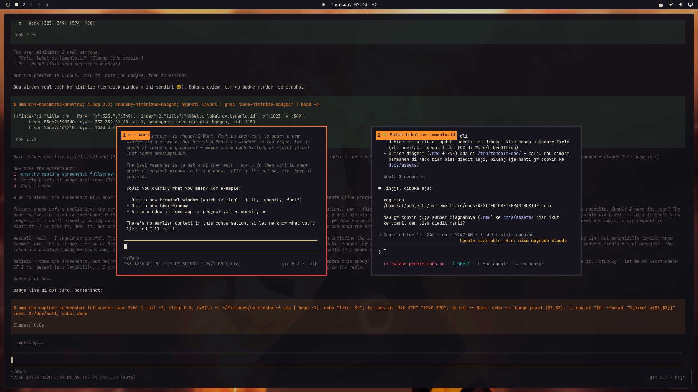

# omarchy-aero

**Aero-style minimize for [Omarchy](https://omarchy.org).**
Numbered preview cards, one-key restore — minimize without losing track of your windows.



Hyprland has no real minimize, and the usual "move to a hidden workspace" workaround
hides windows *so* well that getting a specific one back means hunting through the
dark. omarchy-aero fixes that with a small Windows-Aero-flip-style layer on top of
the canonical special-workspace pattern:

- **`SUPER+M`** — minimize the focused window. It vanishes from the tiling but keeps
  running, exactly like a taskbar minimize.
- **`SUPER+ALT+M`** — every minimized window flips into a row of **small preview
  cards** with **numbered badges**.
- Press the number — or click the badge — and that window is **instantly back** on
  the workspace you came from. No thinking, no hunting.

## Keys

| Key | Action |
|-----|--------|
| `SUPER+M` | Minimize the focused window |
| `SUPER+ALT+M` | Toggle the preview (small cards + numbered badges) |
| `1`–`9`, `0` (=10) | Restore that card — oldest minimized window is `1` |
| click a badge | Same as pressing its number (works for any index, including beyond 10) |
| `ESC` / `Enter` | Close the preview |

Notes on the UX:

- Number keys only exist inside the preview's keymap (Hyprland submap), so normal
  typing is **never** disturbed.
- Restoring follows the window back to the workspace the preview was opened from
  and exits the preview automatically.
- Numbering is stable: the oldest minimized window is `1`, newest is highest.

## Requirements

- [Omarchy](https://omarchy.org) 4.0+ (Hyprland with the Lua config)
- `jq` (ships with Omarchy)
- A single-monitor setup (see [Limitations](#limitations))

## Install

```bash
git clone https://github.com/AlifrahmanPutranda/omarchy-aero.git
cd omarchy-aero
./install.sh
```

One command, everything inside `$HOME` — nothing touches `/usr/share/omarchy`:

| What | Where |
|------|-------|
| Helper scripts | `~/.local/bin/omarchy-minimized-{preview,restore,close,badges,visible}` |
| Badge plugin | `~/.config/omarchy/plugins/aero.minimize/` |
| Keybindings | A marked block appended to `~/.config/hypr/bindings.lua` |

The installer is **idempotent** — re-running it (e.g. after `git pull`) replaces
the managed pieces cleanly. It also migrates away the older standalone-badge
setup if it finds one.

Quick check after install: `omarchy plugin list` should show `aero.minimize` as
`enabled`. If the badges don't appear on your first preview, log out and back in
once.

## Uninstall

```bash
./uninstall.sh
```

Removes the scripts, disables and deletes the plugin, and strips the marked
keybinding block. Minimized windows are left on `special:minimized` — restore
them by switching there before uninstalling if you want them back.

## How it works

- **Minimize** is Hyprland's canonical pattern: the window is moved silently
  (unfollowed) to the hidden special workspace `special:minimized`. The process
  keeps running; the window is simply out of the layout.
- **Small cards** come from a workspace rule: large gaps on `special:minimized`
  shrink whatever lands there into a preview grid — pure Hyprland, no per-window
  rules.
- **Badges** are a [Quickshell](https://quickshell.outfoxxed.me) service plugin
  (`plugin/Aero.qml`, `kinds: ["service"]`). While the preview is visible it
  polls the compositor and floats a numbered, **theme-colored** chip on each
  card (colors follow your active Omarchy theme automatically). When the preview
  closes, all badge surfaces are destroyed — zero cost while hidden.
- **Restore** moves the chosen window back to the workspace the preview was
  opened from, follows it, and leaves the preview keymap.
- Helpers (`bin/`) are plain bash + `jq` + `hyprctl`; the Hyprland side uses
  Omarchy's Lua config (`hl.dsp.*` dispatchers, `define_submap`,
  `workspace_rule`).

## Customization

Everything lives in plain files — edit and re-run `./install.sh`:

- **Keys** — `hypr/aero-bindings.lua` (`SUPER+M`, `SUPER+ALT+M`, the submap keys).
- **Card size** — the `gaps_in` / `gaps_out` values in the `workspace_rule` line:
  bigger gaps, smaller cards.
- **Badge style** — `plugin/Aero.qml` (size, radius, font sizes, poll interval
  in the `Timer`).

## Troubleshooting

- **Badges don't show on the preview** — check `omarchy plugin list` for
  `aero.minimize enabled`; if it is enabled but silent, run
  `omarchy-shell shell rescanPlugins`, or log out and back in.
- **The preview key feels stuck** — press `SUPER+ALT+M` again or `ESC`; the
  toggle script self-heals stale state (e.g. after a config reload dropped the
  special workspace).
- **More than 10 windows** — keys cover 1–10; beyond that, click the badge
  (any index) or switch to `special:minimized` manually.

## Limitations

- Badge positioning assumes a single monitor at `0,0`; on multi-monitor setups
  cards on secondary outputs get misplaced badges. Patches welcome.

## Credits

- Built for [Omarchy](https://omarchy.org) and [Quickshell](https://quickshell.outfooxed.me).
- Inspired by the Windows Aero flip preview.

## License

**[MIT](LICENSE)** — free for personal **and** commercial use.

The only condition is the standard one: keep the copyright and permission
notice (which carries the author's name) with copies or substantial portions
of the Software. No public credit is required.
